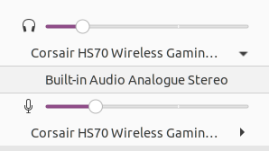

# Gnome-Shell Extension Audio-Output-Switcher

**Device selector**

## Compatibility
  - Gnome Shell:
    - 3.30
    - 3.32
    - 3.34
    - 3.36

For Gnome Shell < 3.30, use version 1.0.

## Installation

Via git

`
git clone git@github.com:AndresCidoncha/audio-switcher.git ~/.local/share/gnome-shell/extensions/audio-switcher@AndresCidoncha
`

Then restart the gnome-shell via **ALT+F2**, typing in the box **r** and enable the extension using gnome-tweak-tool

To update later:

`
(cd ~/.local/share/gnome-shell/extensions/audio-switcher@AndresCidoncha && git pull)
`

## Credits

This extension adds two little entries to the status-menu that shows the currently
selected pulse-audio-output and pulse-audio-input devices. Clicking on that will open a submenu with
all available devices and let's you choose which one to use.

All the credits is for anduchs, this extension is based on his work at [Audio Output Switcher](https://github.com/anduchs/audio-output-switcher) and [Audio Input Switcher](https://github.com/anduchs/audio-input-switcher). I only join them and
add support for the lastest versions of Gnome-shell.

**Thanks to:**
* [ChuckDaniels87](https://github.com/ChuckDaniels87)
* [Martin Wilck](https://github.com/mwilck)
* [Stefan Betz](https://github.com/encbladexp)
* [Christoph Heiss](https://github.com/christoph-heiss)
